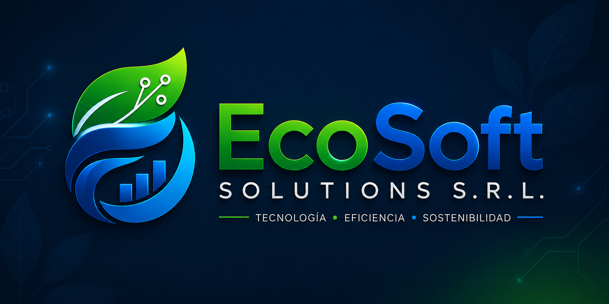
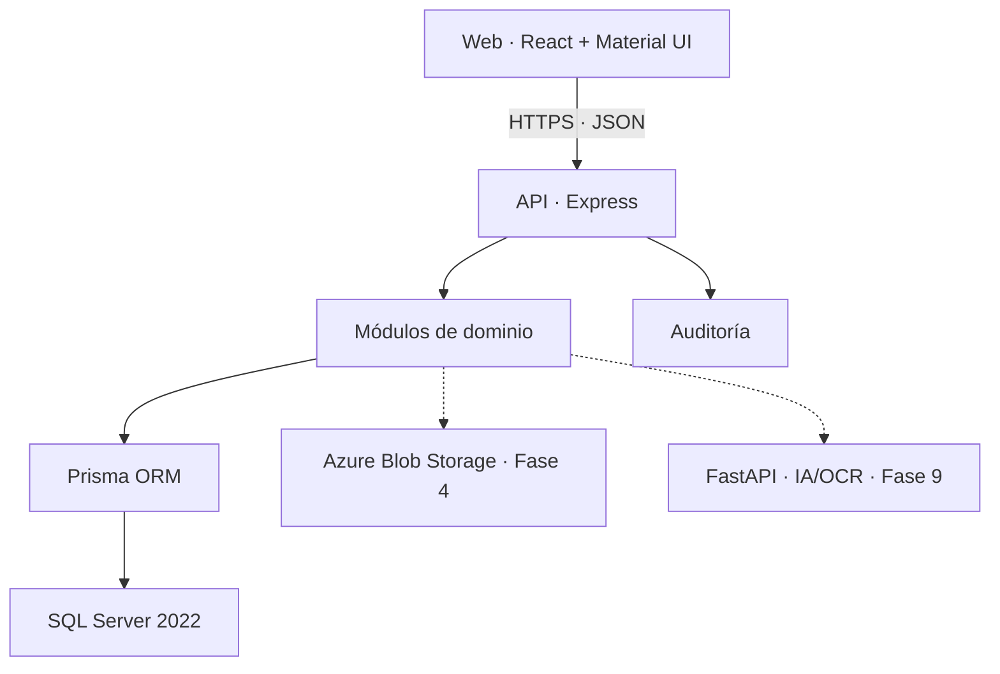

<p align="center">
  
</p>

<p align="center">
  <strong>Sistema de Gestión de Subastas Energéticas y Contratos PPA</strong>
</p>

<p align="center">
  Plataforma SaaS para digitalizar, administrar, supervisar y auditar procesos energéticos de la Comisión Nacional de Energía.
</p>

<p align="center">
  
  
  
</p>

<p align="center">
  <a href="https://github.com/Jairo0811/Ecosoft/actions/workflows/ci.yml"></a>
  
  
  
  
</p>

<p align="center">
  <strong>React · TypeScript · Node.js · Express · Prisma · SQL Server · Docker · GitHub Actions</strong>
</p>

> 🎓 Proyecto académico de **Proyecto de Software 1 (ISO-705)**, desarrollado por el **Grupo #4** de la **Universidad APEC (UNAPEC)** para el caso de estudio de **EcoSoft Solutions S.R.L.** y la **Comisión Nacional de Energía (CNE)**.

---

## 📖 Descripción

**EcoSoft** es una plataforma web SaaS especializada en la digitalización, automatización,
administración, seguimiento y auditoría de **subastas de energía renovable** y **contratos Power
Purchase Agreement (PPA)**.

La solución centraliza en un único entorno la publicación de licitaciones, participación de
empresas, recepción de ofertas, documentación técnica y financiera, evaluación, adjudicación,
seguimiento contractual, regulación, analítica y trazabilidad. La CNE puede administrar,
supervisar y auditar el proceso, mientras las organizaciones autorizadas operan únicamente dentro
de su ámbito y permisos.

EcoSoft se diseña como software empresarial para el sector energético dominicano, priorizando:

- transparencia y trazabilidad de extremo a extremo;
- seguridad, privacidad y autorización comprobada en backend;
- eficiencia administrativa y reducción de procesos fragmentados;
- cumplimiento normativo mediante reglas configurables;
- auditoría de operaciones sensibles;
- analítica e inteligencia artificial como apoyo a decisiones humanas;
- mantenibilidad, accesibilidad y evolución hacia un producto SaaS regional.

## 🎯 Problema y solución

| Problema                                                          | Respuesta de EcoSoft                                                            |
| ----------------------------------------------------------------- | ------------------------------------------------------------------------------- |
| Información dispersa entre correos, hojas de cálculo y documentos | Expediente digital centralizado por licitación, oferta, adjudicación y contrato |
| Procesos manuales con poca visibilidad                            | Flujos de estado, calendarios, alertas, indicadores y reportes                  |
| Riesgo de cambios sin evidencia                                   | Historial, versiones, hashes, snapshots y auditoría con `CorrelationId`         |
| Acceso excesivo o información confidencial expuesta               | RBAC, permisos granulares, alcance por organización y sesiones revocables       |
| Evaluaciones difíciles de justificar                              | Matrices configurables, puntuaciones trazables y aprobación humana              |
| Seguimiento contractual fragmentado                               | Ciclo de vida de contratos PPA, anexos, garantías, renovaciones y vencimientos  |

## 🚫 Alcance excluido

EcoSoft **no es un ERP genérico**. El producto no implementará:

- nómina ni Recursos Humanos;
- contabilidad empresarial general;
- inventario comercial;
- facturación comercial ni punto de venta;
- CRM genérico;
- pasarelas de pago.

Toda funcionalidad debe relacionarse con subastas energéticas, licitaciones, contratos PPA,
proyectos renovables, participantes, documentación, cumplimiento regulatorio, auditoría o
analítica.

---

## ✅ Estado actual

Las **Fases 0, 1, 2 y 3** están implementadas e integradas en `main`. La **Fase 7** está
implementada en la rama de trabajo, pendiente de revisión e integración.

### 🔐 Identidad y seguridad

- Login, logout y renovación rotativa de sesiones.
- Access tokens JWT de corta duración.
- Refresh tokens almacenados únicamente como hash SHA-256.
- Bloqueo temporal después de intentos fallidos.
- RBAC con roles y permisos granulares validados en la API.
- Revocación inmediata de sesiones mediante `authVersion`.
- Protección de la última cuenta `SUPER_ADMIN` activa.
- Auditoría de autenticación y operaciones administrativas.

### 👥 Organizaciones y usuarios

- Registro y revisión de organizaciones participantes.
- Estados de aprobación, rechazo y suspensión.
- Catálogos configurables de tecnología, moneda y zona horaria.
- Invitaciones de usuario de un solo uso con expiración y token almacenado como hash.
- Activación de cuenta con contraseña fuerte.
- Administración de roles, estado, bloqueo e invitaciones pendientes.
- Alcance institucional para CNE y aislamiento de administradores empresariales por organización.

### 🖥️ Experiencia web y plataforma

- Login, Dashboard, participantes, catálogos y administración de usuarios.
- Layout corporativo responsive con sidebar, header y modo claro/oscuro.
- Identidad visual oficial de EcoSoft.
- API versionada, Swagger/OpenAPI, logs estructurados y `CorrelationId`.
- Health checks de liveness y readiness.
- Docker Compose con SQL Server 2022.
- Pruebas automatizadas y GitHub Actions con integración real contra SQL Server.

### ⚡ Licitaciones, subastas y calendario

- Creación y configuración por tecnología, moneda, capacidad y precio máximo.
- Ciclo de estados controlado desde borrador hasta adjudicación, finalización o cancelación.
- Requisitos legales, técnicos, financieros y regulatorios configurables.
- Participantes limitados a organizaciones aprobadas.
- Historial inmutable de eventos y auditoría de cada operación sensible.
- Aislamiento de borradores y visibilidad empresarial por participación habilitada.
- Hitos automáticos de apertura, cierre, evaluación y adjudicación.
- Calendario mensual, semanal y en lista con eventos institucionales manuales.

### 📊 Dashboard, analítica y reportes

- Dashboard conectado a datos reales, sin KPIs demostrativos hardcodeados.
- MW licitados, ofertados, adjudicados, instalados, contratados y operativos.
- Tendencias mensuales, capacidad por tecnología y distribución de estados.
- Contratos vigentes o próximos a vencer, eventos, alertas y actividad auditada.
- Alcance institucional o empresarial aplicado en backend para prevenir exposición entre empresas.
- Reportes de subastas, participantes, ofertas, adjudicaciones, PPA, proyectos, capacidad y auditoría.
- Filtros por período, organización, tecnología y estado.
- Exportación auditable a CSV, Excel y PDF con protección contra fórmulas maliciosas.

> Los enlaces de activación se devuelven únicamente en desarrollo. En producción no se expone el token y queda pendiente conectar un proveedor transaccional de correo.

---

## 🧩 Módulos del producto

| Módulo                            | Responsabilidad                                        |        Fase | Estado          |
| --------------------------------- | ------------------------------------------------------ | ----------: | --------------- |
| Auth, Users, Roles y Permissions  | Identidad, sesiones, RBAC y administración             |         1–2 | ✅ Implementado |
| Organizations y Participants      | CNE, empresas y participantes autorizados              |           2 | ✅ Implementado |
| Auctions y Calendar               | Licitaciones, reglas, cronograma y eventos auditados   |           3 | ✅ Implementado |
| Bids y Documents                  | Ofertas, versiones, confidencialidad y documentos      |           4 | ⏳ Planificado  |
| Evaluations y Awards              | Matrices configurables, puntuación y adjudicación      |           5 | ⏳ Planificado  |
| PPAContracts y EnergyProjects     | Contratos, anexos, renovaciones y proyectos renovables |           6 | ⏳ Planificado  |
| Reports y Analytics               | KPIs, tendencias, filtros y exportaciones              |           7 | ✅ Implementado |
| Audit, Regulatory y Notifications | Gobierno, normativa, trazabilidad y alertas            |           8 | 🟡 Base inicial |
| AI y OCR                          | Análisis consultivo, anomalías, resumen y extracción   |           9 | ⏳ Planificado  |
| Administration                    | Configuración operativa y catálogos                    | Transversal | 🟡 Parcial      |

## 👥 Roles iniciales

| Rol                      | Alcance principal                                                                   |
| ------------------------ | ----------------------------------------------------------------------------------- |
| `SUPER_ADMIN`            | Administración completa y protección de continuidad operativa                       |
| `CNE_ADMIN`              | Usuarios, organizaciones y procesos institucionales, excepto elevar a `SUPER_ADMIN` |
| `AUCTION_MANAGER`        | Creación, actualización y publicación de subastas                                   |
| `TECHNICAL_EVALUATOR`    | Evaluación técnica de ofertas autorizadas                                           |
| `FINANCIAL_EVALUATOR`    | Evaluación financiera de ofertas autorizadas                                        |
| `REGULATORY_SUPERVISOR`  | Supervisión, cumplimiento y trazabilidad regulatoria                                |
| `AUDITOR`                | Consulta de procesos y registros de auditoría                                       |
| `COMPANY_ADMIN`          | Usuarios y actividad dentro de su propia organización                               |
| `COMPANY_REPRESENTATIVE` | Participación y presentación de ofertas empresariales                               |
| `READ_ONLY`              | Consulta autorizada sin operaciones de modificación                                 |

La visibilidad de la interfaz nunca reemplaza la autorización. Cada ruta protegida comprueba los
permisos y, cuando corresponde, la pertenencia a la organización para prevenir IDOR.

---

## 🧱 Stack tecnológico

### 🎨 Frontend

<p align="center">
  
</p>

| Área                     | Tecnología                  |
| ------------------------ | --------------------------- |
| UI                       | React 19 y Material UI      |
| Lenguaje                 | TypeScript                  |
| Construcción             | Vite                        |
| Navegación               | React Router                |
| Estado remoto            | TanStack Query              |
| Formularios y validación | React Hook Form y Zod       |
| HTTP                     | Axios                       |
| Tablas y visualización   | TanStack Table y ApexCharts |
| Fechas                   | date-fns                    |

### ⚙️ Backend

<p align="center">
  
</p>

| Área          | Tecnología                                 |
| ------------- | ------------------------------------------ |
| Runtime       | Node.js 20.19+; Node.js 22 LTS recomendado |
| API           | Express 5 y TypeScript                     |
| Persistencia  | Prisma ORM                                 |
| Autenticación | JWT, refresh tokens rotativos y bcrypt     |
| Validación    | Zod                                        |
| Contrato API  | Swagger / OpenAPI 3                        |
| Logging       | Pino y correlation IDs                     |

### 🗄️ Datos y almacenamiento

<p align="center">
  
  &nbsp;&nbsp;
  
</p>

- Microsoft SQL Server 2022 como sistema de registro.
- Prisma Migrate para evolución controlada del esquema.
- Azure Blob Storage planificado para documentos; SQL Server conservará metadata, hashes y
  referencias.
- Fechas de backend y base de datos en UTC.

### 🤖 Inteligencia artificial y OCR — Fase 9

<p align="center">
  
  
</p>

- Servicio Python/FastAPI aislado mediante interfaces.
- OpenAI API o Azure OpenAI como proveedor sustituible.
- Azure AI Document Intelligence como proveedor OCR principal, también abstraído.
- IA consultiva: nunca adjudica subastas, aprueba contratos ni modifica información oficial.
- Respuestas sujetas a permisos, confidencialidad, fuentes internas y trazabilidad.

### 🧪 Calidad e infraestructura

<p align="center">
  
</p>

| Área                      | Tecnología                           |
| ------------------------- | ------------------------------------ |
| Contenedores              | Docker y Docker Compose              |
| Integración continua      | GitHub Actions                       |
| Backend                   | Jest y Supertest                     |
| Frontend                  | Vitest y React Testing Library       |
| Calidad                   | ESLint, Prettier y TypeScript strict |
| E2E planificado           | Playwright                           |
| Seguridad de dependencias | `npm audit` en CI                    |

---

## 🏗️ Arquitectura

EcoSoft comienza como un **monolito modular**. Esta decisión evita microservicios prematuros,
reduce el costo operativo del proyecto académico y conserva límites de módulo que permiten una
extracción futura.



Flujo protegido:

```text
Request → Security Middleware → Permission/Organization Scope → Zod → Domain → Prisma → SQL Server → Audit
```

### 📁 Estructura principal

```text
EcoSoft/
├── .github/workflows/       # Integración continua
├── apps/
│   ├── api/                 # API Express, Prisma, módulos y pruebas Jest
│   └── web/                 # React, Material UI y pruebas Vitest
├── packages/
│   └── shared/              # Contratos y constantes compartidas
├── docs/
│   ├── architecture/        # ADRs
│   └── requirements/        # Alcance y supuestos del MVP
├── docker-compose.yml       # SQL Server para desarrollo
├── CONTRIBUTING.md
├── LICENSE
└── README.md
```

`apps/ai-service` se incorporará en la Fase 9, cuando existan contratos de IA concretos. No se crea
un servicio vacío antes de necesitarlo.

## 🧩 Principios de ingeniería

- Clean Code, SOLID, DRY y KISS.
- Type Safety y validación en los límites del sistema.
- Security by Design y Privacy by Design.
- Autorización únicamente en backend.
- Reglas configurables cuando la regulación todavía no está definida.
- No eliminación física de adjudicaciones y otros registros críticos.
- Proveedores externos desacoplados mediante puertos e interfaces.
- IA con humano en el circuito y sin autoridad sobre decisiones oficiales.

---

## 🚀 Ejecución local

### 📋 Requisitos

- Node.js 20.19 o superior; Node.js 22 LTS recomendado.
- npm 10 o superior.
- Docker Desktop, o una instancia accesible de SQL Server 2022.
- Git.

### 1️⃣ Clonar y configurar

```bash
git clone https://github.com/Jairo0811/Ecosoft.git
cd Ecosoft
cp .env.example .env
```

Define una contraseña fuerte para SQL Server y actualiza tanto `MSSQL_SA_PASSWORD` como la
contraseña dentro de `DATABASE_URL`. También debes establecer `SEED_ADMIN_PASSWORD` y reemplazar
los secretos JWT de ejemplo.

### 2️⃣ Iniciar SQL Server

```bash
docker compose up -d sqlserver
docker compose ps
```

El volumen `ecosoft-sqlserver` conserva la base entre reinicios. No uses
`docker compose down --volumes` salvo que quieras eliminar los datos locales.

### 3️⃣ Instalar y preparar la base de datos

```bash
npm install
npm run db:generate
npm run db:migrate
npm run db:seed
```

### 4️⃣ Ejecutar la solución

```bash
npm run dev
```

| Servicio       | URL local                                   |
| -------------- | ------------------------------------------- |
| Aplicación web | `http://localhost:5173`                     |
| API REST       | `http://localhost:4000/api/v1`              |
| Swagger        | `http://localhost:4000/api/docs`            |
| Liveness       | `http://localhost:4000/api/v1/health/live`  |
| Readiness      | `http://localhost:4000/api/v1/health/ready` |

## 🔑 Acceso inicial de desarrollo

| Campo      | Valor                                |
| ---------- | ------------------------------------ |
| Usuario    | `admin@ecosoft.com.do`               |
| Contraseña | Valor local de `SEED_ADMIN_PASSWORD` |
| Rol        | `SUPER_ADMIN`                        |

El repositorio no incluye una contraseña predeterminada. El seed se detiene si
`SEED_ADMIN_PASSWORD` está ausente o tiene menos de 12 caracteres.

## ⚙️ Variables de entorno

| Variable                   | Uso                                        |
| -------------------------- | ------------------------------------------ |
| `MSSQL_SA_PASSWORD`        | Inicializa el contenedor de SQL Server     |
| `DATABASE_URL`             | Cadena Prisma hacia SQL Server             |
| `JWT_ACCESS_SECRET`        | Firma access tokens de corta duración      |
| `JWT_REFRESH_SECRET`       | Firma refresh tokens rotativos             |
| `ACCESS_TOKEN_TTL_SECONDS` | Vigencia del access token                  |
| `REFRESH_TOKEN_TTL_DAYS`   | Vigencia máxima de la sesión renovable     |
| `INVITATION_TTL_HOURS`     | Vigencia de invitaciones de usuario        |
| `SEED_ADMIN_PASSWORD`      | Contraseña local del administrador inicial |
| `WEB_ORIGIN`               | Origen permitido por CORS                  |
| `VITE_API_URL`             | Base URL consumida por el frontend         |
| `LOG_LEVEL`                | Nivel de logging de Pino                   |

Nunca almacenes secretos reales en Git. Antes de producción se requiere un gestor de secretos,
TLS en el borde y credenciales de mínimo privilegio para base de datos.

---

## 🧪 Calidad, pruebas y CI

```bash
npm run format:check
npm run lint
npm run typecheck
npm test
npm run build
```

Cada pull request ejecuta:

1. instalación reproducible con `npm ci`;
2. validación de formato;
3. ESLint;
4. TypeScript sin emisión;
5. pruebas backend y frontend;
6. build de producción;
7. auditoría de dependencias de producción;
8. migraciones, seed y readiness contra **SQL Server 2022 real**.

Una fase no se considera terminada hasta que código, tipos, lint, pruebas, migraciones, SQL Server,
autorización, OpenAPI, frontend, documentación y CI estén verdes.

## 🛡️ Seguridad

- Helmet y security headers.
- CORS restrictivo y rate limiting.
- JWT de corta duración y refresh token rotation.
- Contraseñas con bcrypt y secretos fuera del repositorio.
- Validación Zod, Prisma y consultas parametrizadas.
- RBAC, permisos granulares y alcance por organización.
- Auditoría con usuario, organización, IP, User Agent, UTC, módulo, entidad y `CorrelationId`.
- Errores controlados sin stack traces en producción.
- Tokens de invitación y renovación almacenados exclusivamente como hash.
- Revocación inmediata de sesiones después de suspensión o cambio de roles.

Pendientes antes de producción: Azure Key Vault, TLS en el borde, proveedor transaccional de
correo, política CSP afinada, pruebas IDOR ampliadas, respaldo/restauración y revisión formal de
privacidad.

---

## 🗺️ Roadmap

| Fase | Incremento                                          | Estado          |
| ---: | --------------------------------------------------- | --------------- |
|    0 | Análisis, arquitectura, ERD, riesgos y ADRs         | ✅ Completada   |
|    1 | Foundation, Authentication y RBAC                   | ✅ Completada   |
|    2 | Organizaciones, participantes y usuarios            | ✅ Completada   |
|    3 | Licitaciones, subastas y calendario                 | ✅ Completada   |
|    4 | Ofertas inmutables y documentos                     | ▶️ Siguiente    |
|    5 | Evaluaciones configurables y adjudicaciones         | ⏳ Pendiente    |
|    6 | Contratos PPA y proyectos energéticos               | ⏳ Pendiente    |
|    7 | Dashboard, analítica y reportes                     | ✅ Implementada |
|    8 | Auditoría ampliada, regulación y notificaciones     | ⏳ Pendiente    |
|    9 | IA, OCR y análisis predictivo con aprobación humana | ⏳ Pendiente    |
|   10 | Hardening, QA, WCAG 2.2 AA, CI/CD y documentación   | ⏳ Pendiente    |

El proyecto utiliza Scrum y trata cada fase como un incremento potencialmente entregable. Su
diseño considera una duración académica máxima de 12 meses, presupuesto limitado, protección de
datos y posible evolución comercial hacia América Latina y el Caribe, sin introducir
multi-tenancy complejo en el MVP.

## 📚 Documentación

| Documento                                   | Contenido                                    |
| ------------------------------------------- | -------------------------------------------- |
| [Arquitectura](docs/architecture.md)        | Decisiones, módulos y flujo protegido        |
| [Base de datos](docs/database.md)           | Modelo, convenciones y evolución prevista    |
| [Seguridad](docs/security.md)               | Controles, amenazas y pendientes productivos |
| [Contrato API](docs/api.md)                 | Convenciones y endpoints por fase            |
| [Inteligencia artificial](docs/ai.md)       | Límites, casos de uso y gobernanza           |
| [Despliegue](docs/deployment.md)            | Estrategia operativa y ambientes             |
| [MVP y supuestos](docs/requirements/mvp.md) | Alcance funcional y decisiones abiertas      |
| [Backlog](docs/backlog.md)                  | Épicas priorizadas                           |
| [Riesgos](docs/risks.md)                    | Riesgos técnicos y de producto               |
| [ADRs](docs/architecture/)                  | Decisiones de arquitectura documentadas      |

---

## 🎓 Información académica

| Información          | Detalle                                             |
| -------------------- | --------------------------------------------------- |
| 🏫 Institución       | Universidad APEC — UNAPEC                           |
| 📖 Asignatura        | Proyecto de Software 1 (ISO-705)                    |
| 👨‍🏫 Profesor          | Ing. Santo Rafael Navarro                           |
| 👥 Equipo            | Grupo #4                                            |
| 🏢 Empresa del caso  | EcoSoft Solutions S.R.L.                            |
| ⚡ Cliente principal | Comisión Nacional de Energía (CNE)                  |
| 📅 Período Academico           | Mayo – Agosto de 2026                                 |
| 📁 Tipo              | Proyecto académico grupal de ingeniería de software |

### 👥 Equipo del proyecto

| 👤 Integrante                    | 🆔 Matrícula | Participación                    |
| ----------------------------- | --------- | -------------------------------- |
| 👩🏻‍💻 Emely Marie Castillo Rivera   | A00110380 | Equipo de proyecto               |
| 👨🏻‍💻 Héctor David Pichardo Ortiz   | A00110746 | Líder del proyecto               |
| 👩🏻‍💻 Nathaly Patricia Tamayo Ortiz | A00113859 | Equipo de proyecto               |
| 👨🏻‍💻 Francis Jairo Matías Rosario  | A00115261 | Equipo de proyecto y repositorio |

Los integrantes se presentan en orden ascendente de matrícula.

## 👨‍💻 Repositorio

**Francis Jairo Matías Rosario — Jairo Matías**

- 🎓 Tecnólogo en Desarrollo de Software — ITLA.
- 🎓 Estudiante de Ingeniería de Software — UNAPEC.
- 🔗 GitHub: [@Jairo0811](https://github.com/Jairo0811)

Este repositorio conserva y desarrolla el incremento técnico del proyecto académico del Grupo #4.

## 🤝 Contribución

Consulta [CONTRIBUTING.md](CONTRIBUTING.md). El flujo usa ramas de trabajo, pull requests,
Conventional Commits y CI obligatorio. No se trabaja directamente sobre `main`.

## 📄 Licencia

Este proyecto se distribuye bajo la [Licencia MIT](LICENSE). © 2026 Jairo Matías y colaboradores
del Grupo #4.

---

<p align="center">
  <strong>EcoSoft Solutions S.R.L.</strong><br>
  Tecnología · Eficiencia · Sostenibilidad
</p>
