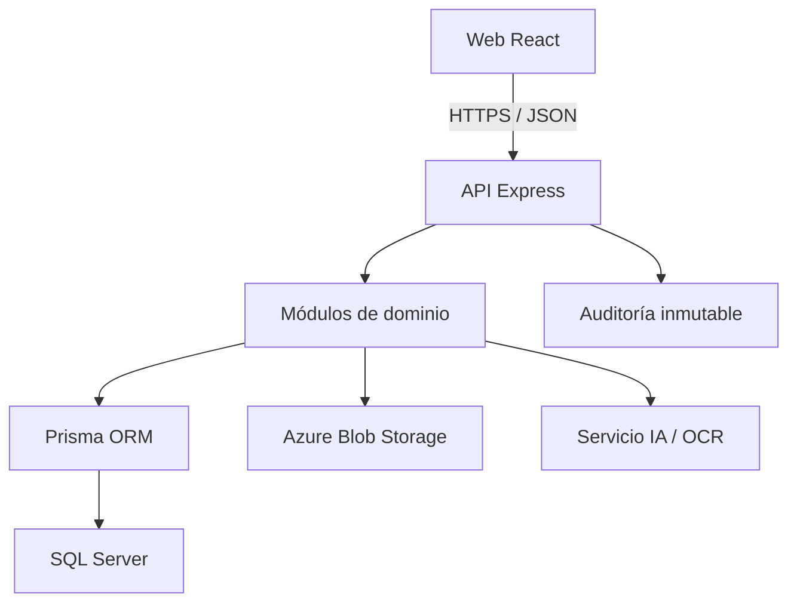

# Arquitectura de EcoSoft

## Contexto y decisión

EcoSoft comienza como un **monolito modular** desplegable en Azure. Esta forma reduce costo y
riesgo operativo durante el proyecto académico, manteniendo límites de módulo que permiten una
extracción futura. La API es la única autoridad sobre permisos y reglas del dominio.

## Módulos

| Contexto      | Responsabilidad                                           | Fase |
| ------------- | --------------------------------------------------------- | ---: |
| Identity      | autenticación, sesiones, roles y permisos                 |    1 |
| Organizations | CNE, empresas y participantes autorizados                 |    2 |
| Auctions      | licitaciones, reglas, cronograma y eventos                |    3 |
| Bids          | oferta, versiones, documentos y hash de integridad        |    4 |
| Evaluations   | matrices configurables, puntuaciones y revisión           |    5 |
| Awards        | adjudicación y aprobaciones inmutables                    |    5 |
| Contracts     | contratos PPA, anexos, renovaciones y versiones           |    6 |
| Projects      | proyectos renovables y capacidad energética               |    6 |
| Reporting     | indicadores, filtros y exportaciones                      |    7 |
| Governance    | regulación, auditoría y notificaciones                    |    8 |
| AI            | recomendaciones, OCR y análisis con humano en el circuito |    9 |

## Componentes

El acceso al servicio de IA, almacenamiento y tiempo real se realizará mediante puertos e
interfaces. Ningún proveedor se filtra al dominio. Auctions ya publica al puerto
`AuctionRealtimePublisher`; el adaptador Socket.IO se añadirá con la recepción de ofertas, cuando
existan consumidores en vivo y reglas formales de confidencialidad.

Governance expone además `realtimeNotificationPublisher` y `emailNotificationPublisher`. Ambos
son puertos sin proveedor durante el MVP: permiten validar autorización, deduplicación y ciclo de
lectura sin acoplar el dominio a Socket.IO o a un servicio de correo. La decisión se detalla en
ADR-006.

## Flujo de una solicitud protegida

1. El middleware asigna o valida `X-Correlation-Id`.
2. Helmet, CORS, límites de tamaño y rate limiting reducen superficie de ataque.
3. Se valida el JWT y se recuperan identidad, organización y permisos.
4. El endpoint exige permisos explícitos; la UI nunca es autoridad.
5. Zod valida la entrada y el servicio ejecuta la operación.
6. Prisma persiste dentro de una transacción cuando la consistencia lo requiere.
7. Las operaciones sensibles generan un registro de auditoría UTC.

## Reglas de dependencia

- Las rutas dependen de servicios, no de Prisma directamente.
- Los módulos no leen tablas de otros módulos sin un contrato público.
- `packages/shared` contiene DTOs y constantes, nunca secretos ni lógica de autorización.
- Las fechas se almacenan en UTC; la zona horaria es un dato de presentación/configuración.
- Las eliminaciones críticas son lógicas o se representan como una transición de estado.
