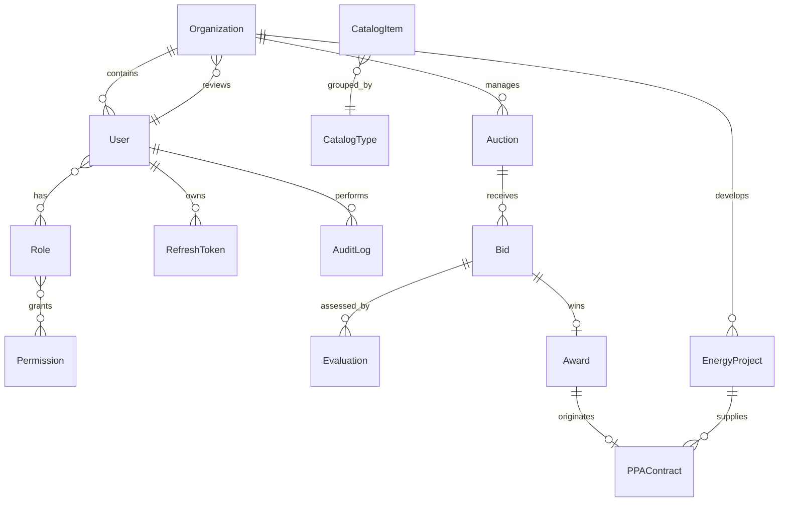

# Modelo de datos

SQL Server es el sistema de registro. Prisma administra el esquema y las migraciones. Los archivos
se almacenarán en Azure Blob Storage; SQL Server conserva metadatos, hashes y referencias.

## ERD inicial y evolución prevista

La migración de Fase 1 crea identidad, organizaciones, sesiones y auditoría. La Fase 2 amplía la
organización con contactos y decisiones de revisión, agrega un índice único filtrado para permitir
RNC nulo y crea catálogos controlados. Las entidades de subastas y contratos se agregarán con sus
invariantes en sus respectivas fases para no congelar reglas aún no definidas.

## Convenciones

- UUID (`uniqueidentifier`) como clave primaria.
- `createdAt`, `updatedAt` y fechas de negocio en UTC.
- índices únicos en email, RNC no nulo, códigos de rol, permisos y códigos por tipo de catálogo.
- `rowVersion` se agregará a agregados con edición concurrente (ofertas, evaluaciones y contratos).
- datos críticos no se eliminan físicamente desde la aplicación.
- los hashes de refresh tokens y documentos se almacenan, nunca los valores sensibles originales.
