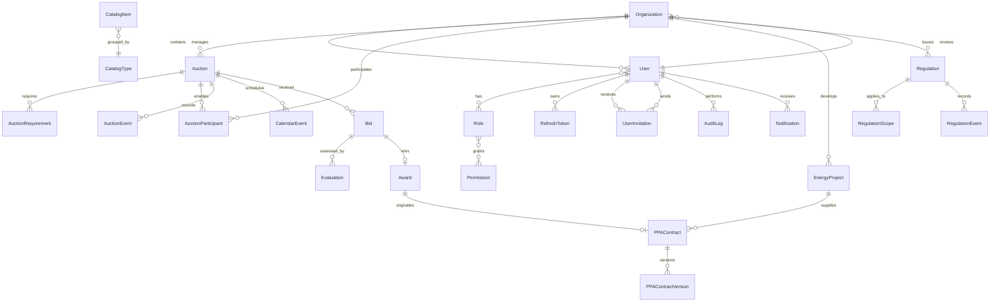

# Modelo de datos

SQL Server es el sistema de registro. Prisma administra el esquema y las migraciones. Los archivos
se almacenarán en Azure Blob Storage; SQL Server conserva metadatos, hashes y referencias.

## ERD inicial y evolución prevista

La migración de Fase 1 crea identidad, organizaciones, sesiones y auditoría. La Fase 2 amplía la
organización con contactos y decisiones de revisión, agrega un índice único filtrado para permitir
RNC nulo y crea catálogos controlados. Las entidades de subastas y contratos se agregarán con sus
invariantes en sus respectivas fases para no congelar reglas aún no definidas.

La ampliación de usuarios agrega `authVersion`, usada para invalidación inmediata de sesiones, y
`UserInvitation`, que conserva el hash del token, emisor, vencimiento, aceptación y revocación.

La Fase 3 incorpora `Auction`, requisitos configurables, participantes autorizados, eventos de
dominio de solo anexado y eventos de calendario. Los hitos automáticos de apertura, cierre,
evaluación y adjudicación se sincronizan con el cronograma. Restricciones SQL Server protegen
capacidad/precio positivos y el orden básico de fechas.

La Fase 7 incorpora la base de agregados analíticos (`Bid`, `Award`, `EnergyProject`,
`PPAContract` y `PPAContractVersion`) necesaria para calcular indicadores sin datos simulados. Los
índices por organización, tecnología, estado, provincia y vencimiento soportan filtros y alertas.
Los reportes se calculan desde las tablas transaccionales; no mantienen una segunda fuente de
verdad ni almacenan archivos exportados en SQL Server.

La Fase 8 agrega `Regulation`, `RegulationScope`, `RegulationEvent` y `Notification`. Las
regulaciones conservan autoridad emisora, vigencia, fuente oficial, referencia documental y
alcances configurables. `RegulationEvent` registra un historial de solo anexado. Las
notificaciones usan la restricción única `(userId, sourceKey)` para que recalcular alertas no
duplique mensajes.

`AuditLog.eventHash` contiene SHA-256 del contenido canónico y redactado del evento. Los triggers
`TR_AuditLog_Immutable` y `TR_RegulationEvent_Immutable` rechazan `UPDATE` y `DELETE` incluso si un
error de aplicación intentara ejecutarlos. Los registros anteriores a la Fase 8 pueden conservar
`eventHash` nulo; todos los eventos nuevos lo incluyen.

## Convenciones

- UUID (`uniqueidentifier`) como clave primaria.
- `createdAt`, `updatedAt` y fechas de negocio en UTC.
- índices únicos en email, RNC no nulo, códigos de rol, permisos y códigos por tipo de catálogo.
- `rowVersion` se agregará a agregados con edición concurrente (ofertas, evaluaciones y contratos).
- datos críticos no se eliminan físicamente desde la aplicación.
- los hashes de refresh tokens, invitaciones y documentos se almacenan, nunca los valores
  sensibles originales.
